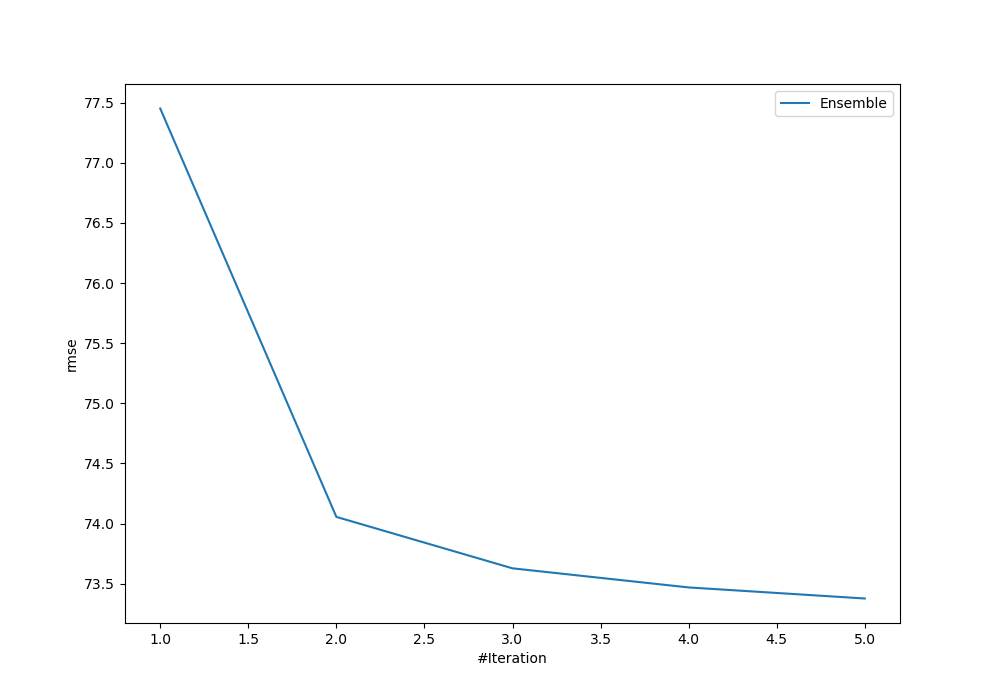

# Summary of Ensemble

[<< Go back](../README.md)

## Ensemble structure
| Model                   |   Weight |
|:------------------------|---------:|
| 3_Default_Xgboost       |        3 |
| 4_Default_NeuralNetwork |        1 |
| 5_Default_RandomForest  |        1 |

### Metric details:
| Metric   |       Score |
|:---------|------------:|
| MAE      |   15.8082   |
| MSE      | 5384.28     |
| RMSE     |   73.3777   |
| R2       |    0.705633 |
| MAPE     |    1.11719  |

## Learning curves

## True vs Predicted

## Predicted vs Residuals

[<< Go back](../README.md)
